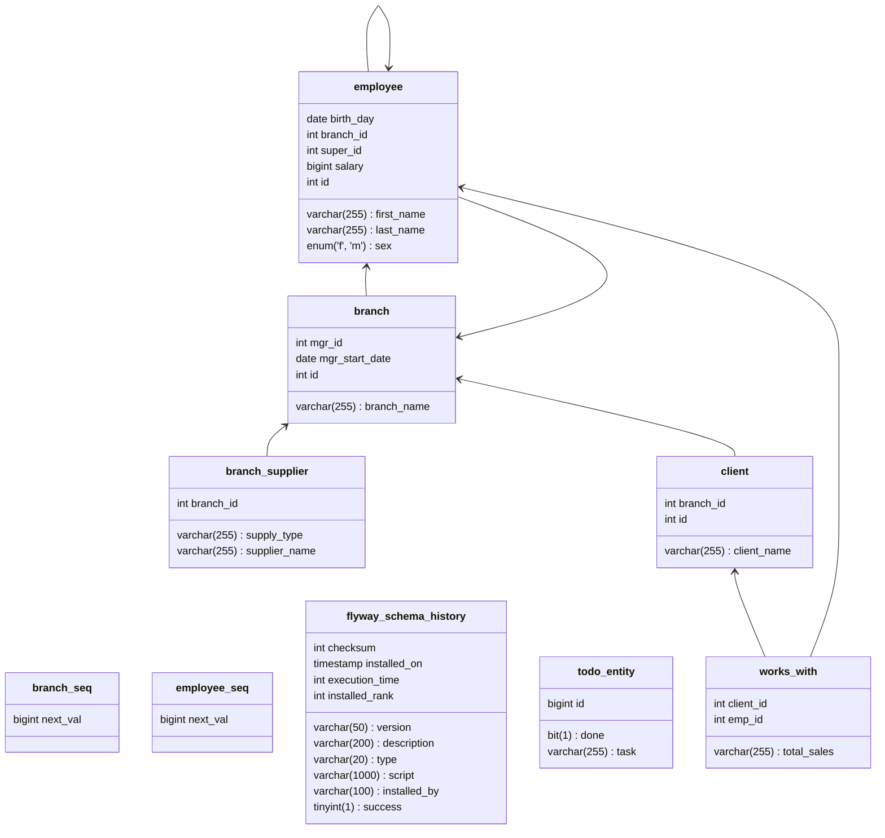

```mermaid

classDiagram
direction BT
class branch {
   int mgr_id
   date mgr_start_date
   varchar(255) branch_name
   int id
}
class branch_seq {
   bigint next_val
}
class branch_supplier {
   varchar(255) supply_type
   int branch_id
   varchar(255) supplier_name
}
class client {
   int branch_id
   varchar(255) client_name
   int id
}
class employee {
   date birth_day
   int branch_id
   int super_id
   bigint salary
   varchar(255) first_name
   varchar(255) last_name
   enum('f', 'm') sex
   int id
}
class employee_seq {
   bigint next_val
}
class flyway_schema_history {
   varchar(50) version
   varchar(200) description
   varchar(20) type
   varchar(1000) script
   int checksum
   varchar(100) installed_by
   timestamp installed_on
   int execution_time
   tinyint(1) success
   int installed_rank
}
class todo_entity {
   bit(1) done
   varchar(255) task
   bigint id
}
class works_with {
   varchar(255) total_sales
   int client_id
   int emp_id
}

branch  -->  employee 
branch_supplier  -->  branch 
client  -->  branch 
employee  -->  branch 
employee  -->  employee 
works_with  -->  client 
works_with  -->  employee 

```
